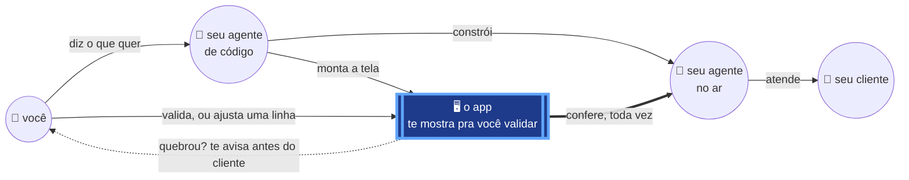

# big picture — quem faz o quê, e onde você entra

Duas pessoas, dois agentes, e **um app no meio de tudo**. Ele te mostra o que o
agente vai fazer *antes* de ele fazer, você valida ali, e depois ele fica
conferindo — é por isso que a notícia ruim chega em você antes de chegar no
cliente.

Como isso funciona por dentro está em [`system_design.md`](system_design.md); o
contrato de asserts, com as 40 primitivas e a origem de cada uma, está em
[`design.md`](design.md).
