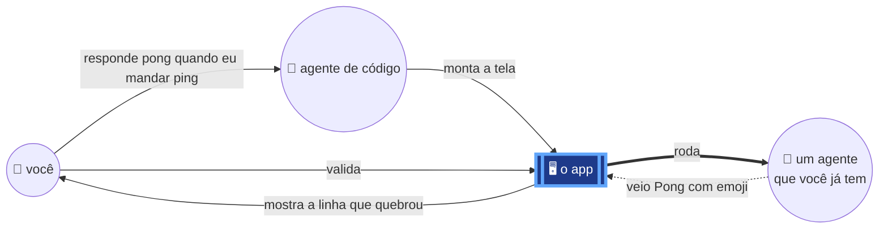
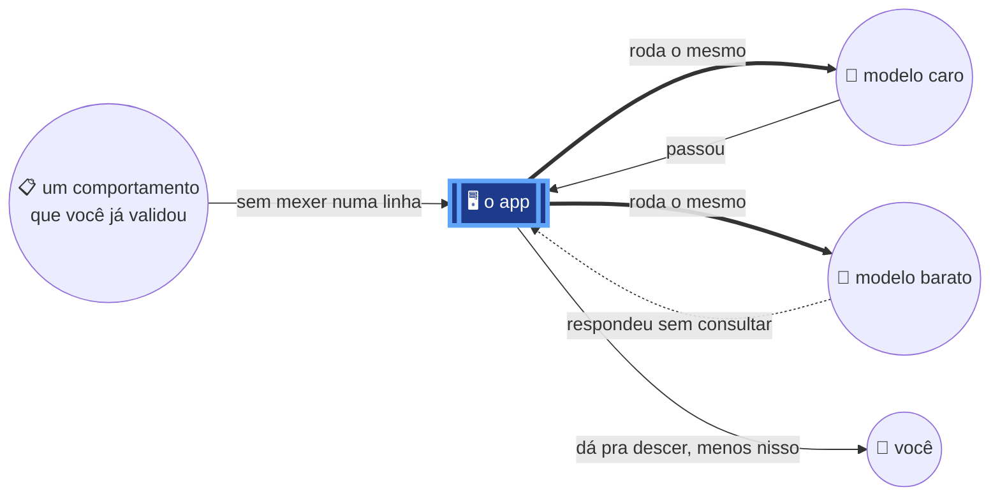
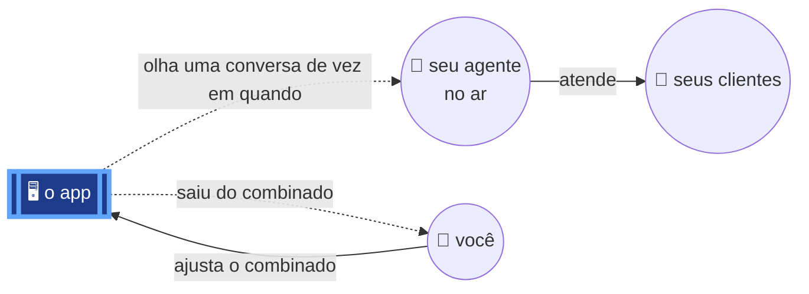

# a primeira fatia — três candidatas

Cada uma é uma experiência **inteira e funcionando**, não uma camada. A escolhida
vira `01_system_design_<nome>.md` e as outras duas saem daqui.

## A · diz, valida, e vê quebrar

Entrega o laço fechado do hero: você diz, o app mostra, você valida, e a primeira
run **falha na sua frente**. É a única das três que prova a tese central — o
critério nasceu antes de qualquer execução, então a divergência é informação.
Precisa de entrevista, tela e um alvo real; não precisa de produção nem de segundo
modelo. Risco: exige que a pessoa já tenha um agente pra apontar.

## B · mesmo teste, dois modelos

Entrega a resposta que ninguém consegue dar hoje olhando a tela: **o que eu perco
se trocar de modelo.** É a fatia que vende sozinha pra quem paga a conta da API, e
a única que mostra o mesmo critério valendo pra dois alvos. Não precisa de
entrevista — o comportamento pode chegar escrito. Risco: público menor, e depende
de já existir um comportamento validado, que é a fatia A.

## C · te avisa antes do cliente

Entrega o momento mais doloroso do hero — **você descobre antes do cliente.** É a
fatia com maior payoff emocional e a mais difícil: exige agente em produção,
amostragem, e um juiz pra opinar onde não existe resposta certa. Risco: é a única
que não funciona sem alvo vivo, então ela não pode ser a primeira sem inventar um.

## Como eu leria a escolha

**A é a única que prova a tese**, e as outras duas dependem dela: B precisa de um
comportamento já validado, C precisa de um agente já no ar com combinado escrito.
Se a decisão for por sequência, é A → B → C. Se for por venda, B chega mais rápido
em quem já tem dor e dinheiro. C é a mais bonita de demonstrar e a pior de começar.
