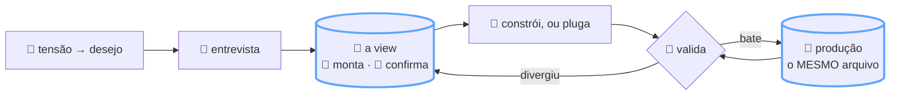
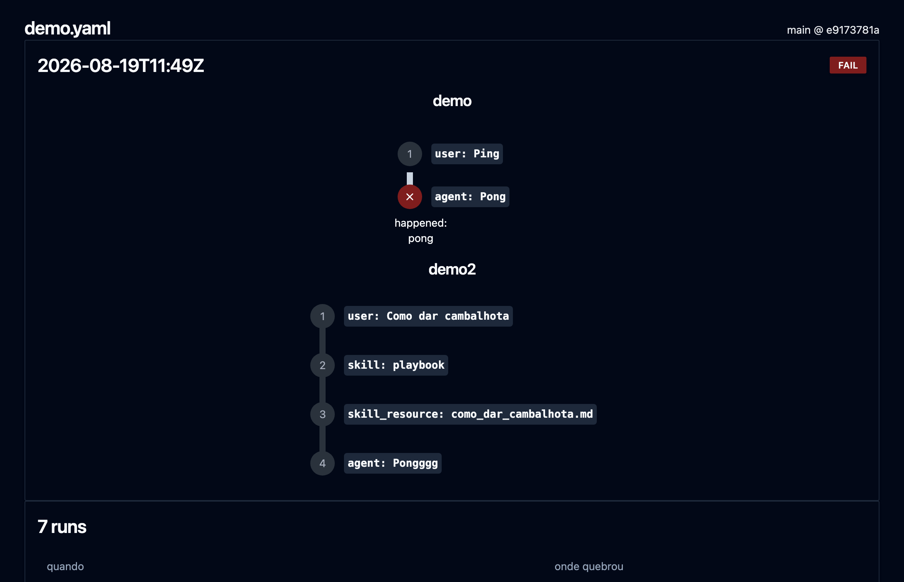
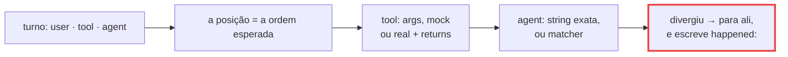
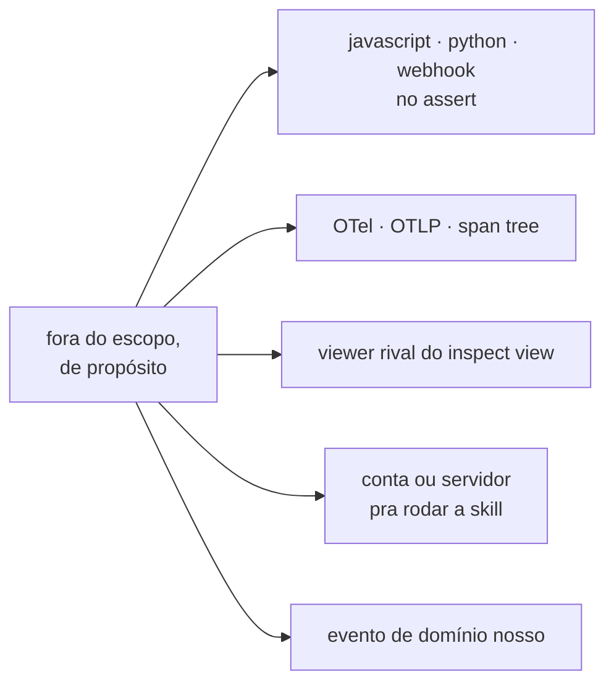
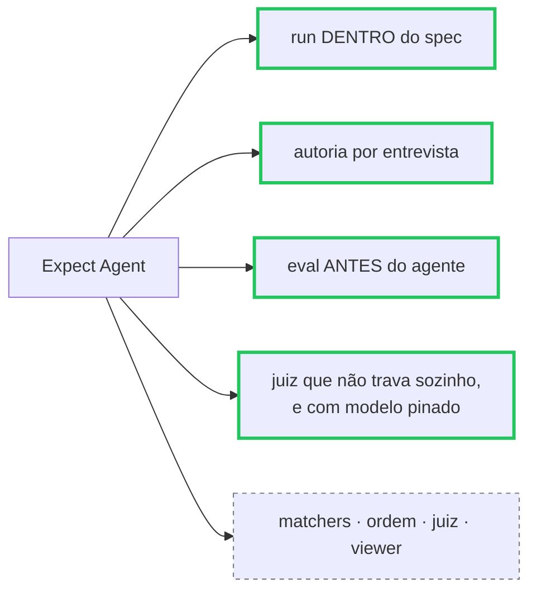
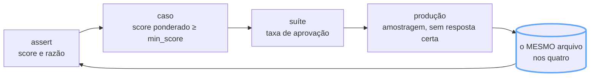
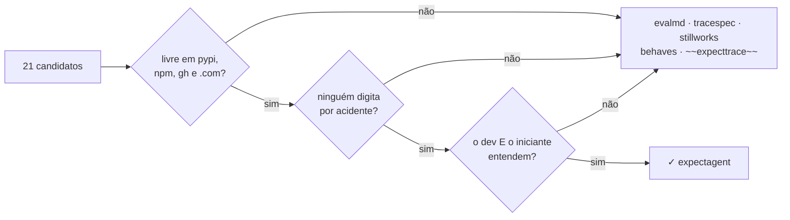
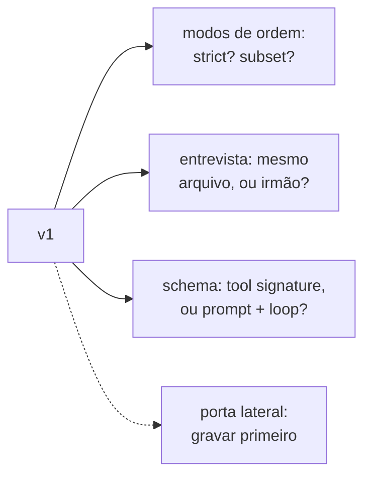

# Expect Agent

**Quer montar seu agente e não sabe por onde começar?**

> Começa dizendo o que ele tem que fazer. Do jeito que você explicaria pra um estagiário. A
> gente garante que ele vai funcionar exatamente do jeito que você planejou.

Do primeiro comportamento até produção:

- **Seja entrevistado.** Você responde; sai escrito como seu fluxo tem que se comportar.
- **Visualize o esperado.** Turno a turno, ferramenta a ferramenta, na ordem em que devem
  acontecer.
- **Plugue ou construa.** Aponta pra um agente que já existe, ou pede pra construir na sua
  stack.
- **Rode.** Compara o construído com o esperado, e para no primeiro turno que divergir.
- **Entregue.** Sobe só o que passa em todos os comportamentos que você desenhou.
- **Siga vendo.** Em produção, o mesmo arquivo continua dizendo o que está acontecendo.

## O conceito

Humano e agente escrevem no MESMO arquivo, da intenção até ela estar medida. Nenhum nó traduz
entre os dois lados, e um nó o agente não atravessa sozinho.

## O contrato de asserts

Todo assert devolve **score e razão**: determinístico dá 0 ou 1, juiz dá 0..1, e o caso passa
quando o score ponderado cruza o `min_score`. É essa peça única que deixa determinístico e
LLM-as-judge morarem no mesmo arquivo, com o mesmo veredito. A coluna de origem é regra, não
crédito: reusa o nome que já existe em vez de inventar sinônimo.

| primitiva | afirma | origem / inspiração |
| --- | --- | --- |
| **preparar, antes de comparar** | | |
| `prepare.extract` | recorta por regex, usa o grupo 1 | simple-evals `ANSWER_PATTERN_MULTICHOICE` |
| `prepare.normalize` | caixa, espaço, pontuação, markdown, LaTeX, emoji | simple-evals `normalize_response` |
| `prepare.redact` | apaga o volátil (id, uuid, timestamp) | insta `redactions` · syrupy matchers |
| **valor** | | |
| `equals` | igual, no valor | Jest `toBe`/`toEqual` · Rust `assert_eq!` · pydantic-evals `Equals` · autoevals `ExactMatch` |
| `contains` | `all`, `any`, `none` — numa chave só | promptfoo `contains-all`/`contains-any`/`not-contains` · Jest `toContain` |
| `matches` | casa com a regex | Jest `toMatch` · promptfoo `regex` |
| `starts_with` · `ends_with` | prefixo, sufixo | promptfoo `starts-with` · Rust `str::starts_with` |
| `one_of` | é um destes | Chai `to.be.oneOf` · hamcrest `is_in` |
| `subset` | estas chaves batem; chave extra não reprova | Jest `toMatchObject` · autoevals `JSONDiff` · dirty_equals |
| `similar` | parecido, por `levenshtein`, `rouge_l`, `bleu` ou `embedding` | promptfoo `levenshtein`/`rouge-n`/`bleu`/`similar` · autoevals `Levenshtein`, `EmbeddingSimilarity` |
| **forma e faixa** | | |
| `is` | `present`, `absent`, ou o tipo | Jest `toBeDefined`/`toBeInstanceOf` · pydantic-evals `IsInstance` |
| `is_valid` | `json`, `yaml`, `xml`, `html`, `sql` — e o schema, se vier | promptfoo `is-json`/`is-xml`/`is-sql`/`is-html` · autoevals `ValidJSON` |
| `range` | `gt` `gte` `lt` `lte` `close_to` — a MESMA forma em `length`, `times` e `budget` | Jest `toBeGreaterThan`/`toBeCloseTo` · pytest `approx` · Rust `approx` |
| `length` | tamanho, como `range` | Jest `toHaveLength` · hamcrest `has_length` |
| **sequência de tools** | | |
| `tools.includes` | estas, nesta ordem; outras no meio, ok | unittest.mock `assert_has_calls(any_order=False)` · agentevals `subset` |
| `tools.any_order` | todas aparecem, ordem indiferente | `assert_has_calls(any_order=True)` · unittest `assertCountEqual` · agentevals `unordered` |
| `tools.exactly` | estas, nesta ordem, e nada mais | `mock_calls == [...]` · agentevals `strict` |
| `tools.only` | allowlist: nada fora deste conjunto | promptfoo `trajectory:tool-used` · ADK tool allowlist |
| `tools.must` · `tools.never` | chamou / não chamou | `assert_any_call` · `assert_not_called` |
| `tools.times` | quantas chamadas, como `range` | Jest `toHaveBeenCalledTimes` · promptfoo `trajectory:step-count` |
| `tools.before` | par ordenado (`first`/`then`), sem afirmar o resto | sinon `assert.callOrder` · jest-extended `toHaveBeenCalledBefore` |
| `tools.nth` | a chamada N foi esta, com estes args | Jest `toHaveBeenNthCalledWith` · sinon `firstCall`/`lastCall` |
| `args` | args como subconjunto, em qualquer chamada | Jest `expect.objectContaining` · promptfoo `trajectory:tool-args-match` |
| **julgamento por modelo** | | |
| `judge.rubric` | critério em prosa; devolve score e razão | promptfoo `llm-rubric` · Langfuse template custom · pydantic-evals `LLMJudge` |
| `judge.preset` | a biblioteca pronta, listada abaixo | Langfuse templates · autoevals · promptfoo model-graded |
| `judge.pairwise` | qual das duas saídas é melhor | autoevals `Battle` · promptfoo `select-best` · LangSmith pairwise |
| `judge.model` | **obrigatório** — modelo e versão pinados | nosso: sem pin, o veredito não reproduz |
| `judge.score` | `numeric` 0..1, `boolean`, ou `categorical` | Langfuse score types |
| `judge.min_score` | trava o gate; sem ele o juiz é advisory | promptfoo `threshold` |
| **orçamento** | | |
| `budget.max_duration_ms` | tempo | pydantic-evals `MaxDuration` · promptfoo `latency` |
| `budget.max_cost_usd` · `budget.max_tokens` | preço | promptfoo `cost` |
| **veredito** | | |
| `weight` | quanto este assert pesa no score do caso | promptfoo `weight` |
| `min_score` | crédito parcial: o caso passa a partir daqui | promptfoo `threshold` · `assert-set` |
| `advisory` | mede e reporta, não reprova | LangSmith online evaluation |
| `not` · `all_of` · `any_of` | combinam qualquer matcher, recursivo | Jest `.not` · hamcrest `all_of`/`any_of` · SpanQuery `and_`/`or_` |
| **fora, de propósito** | | |
| ~~`javascript` `python` `webhook`~~ | código arbitrário dentro do assert | promptfoo tem; pydantic-evals REMOVEU `Python` por segurança (PR #2808) |
| ~~`span_query`~~ | consulta na span tree | pydantic-evals `HasMatchingSpan` — exige OTel de pé |
| ~~`perplexity`~~ | precisa de logprob do provider | promptfoo `perplexity` |

Os presets de `judge`, deduplicados das três plataformas: `factuality`, `hallucination`,
`correctness`, `relevance`, `conciseness`, `helpfulness`, `toxicity`, `safety`, `refusal`,
`summarization`, `sql_equivalence`, `translation`, `security`, `context_faithfulness`,
`context_relevance`, `context_recall`, `context_precision`, `g_eval`, `classifier`.

Três agrupamentos cortaram catálogo sem cortar poder: `contains: {all, any, none}` come quatro
tipos do promptfoo, `similar: {method}` come outros quatro, e `prepare.normalize: [case]` faz os
quatro `icontains*` deixarem de existir. `range` é uma forma só, reusada em `length`, `times` e
`budget`.

O juiz entra com trela curta, e é aqui que a gente difere de quem só oferece o juiz: `model`
pinado é obrigatório, o score e a razão são escritos de volta no arquivo como o `happened:`, e
**um caso não pode ter só juiz** — o schema recusa. Juiz sozinho é eval que não falseia.

## A view

A divergência é a única coisa colorida da tela. O esperado continua escrito; embaixo dele, o
que aconteceu. Não é painel — é o arquivo desenhado.

## O formato

Lista de turnos, um turno ou vinte, sem diferença de forma. A posição É a asserção, e a run
para no primeiro turno que divergir.

## Os boundaries

Zero infra é a feature: nada pode ser OBRIGATÓRIO pra rodar a skill. O app de visualização é
produto à parte — desligue ele e o veredito não muda.

## O MOAT

Verde é o que ninguém faz; cinza é commodity — promptfoo, autoevals, Langfuse e LangSmith já
têm. O moat é a combinação, não nenhuma peça.

## Os três níveis

Caso, suíte e produção, com o mesmo vocabulário — o que muda é a agregação. Em produção não
existe resposta certa, então lá só juiz e guardrail valem.

## O nome

`expect()` é o assert de Jest, Chai, Vitest e Playwright, e também é inglês cotidiano.
`expecttrace` morreu porque *trace* já significa observabilidade — o que os boundaries recusam.

## O que falta decidir

Três forks, e nenhuma bloqueia o primeiro agente. A quarta é porta lateral, pra quem já tem
coisa rodando em produção.
